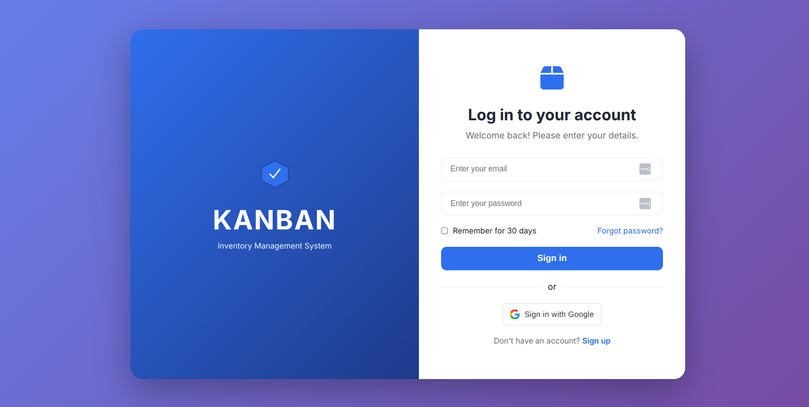
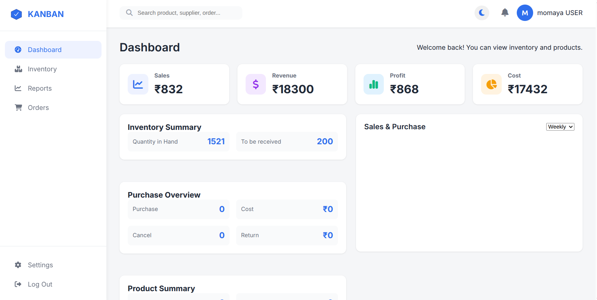
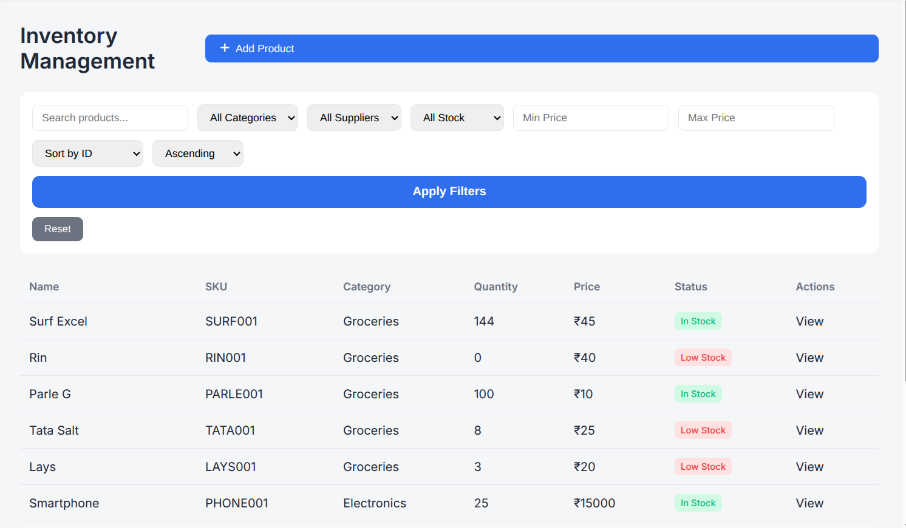
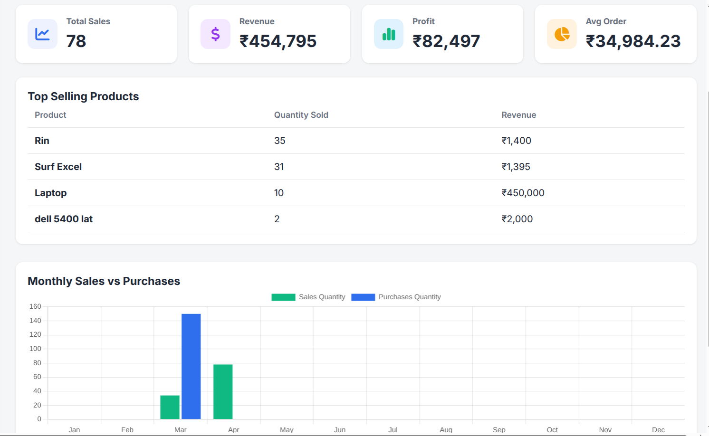
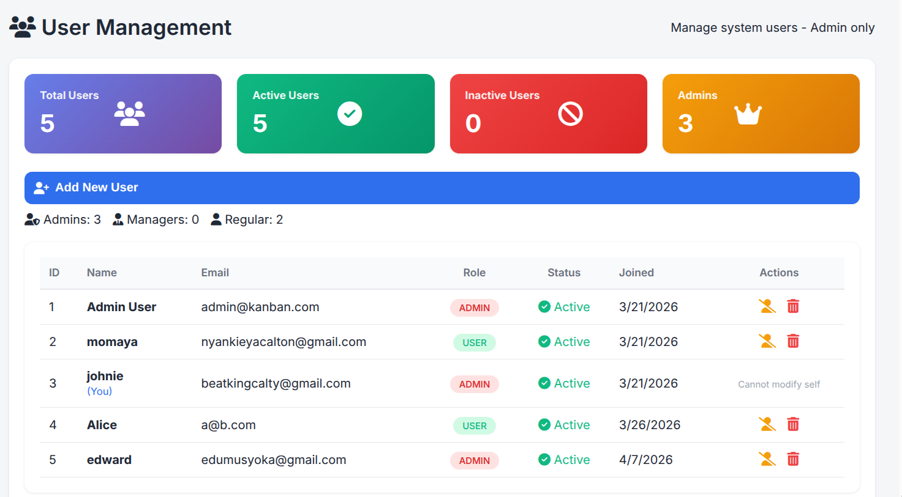
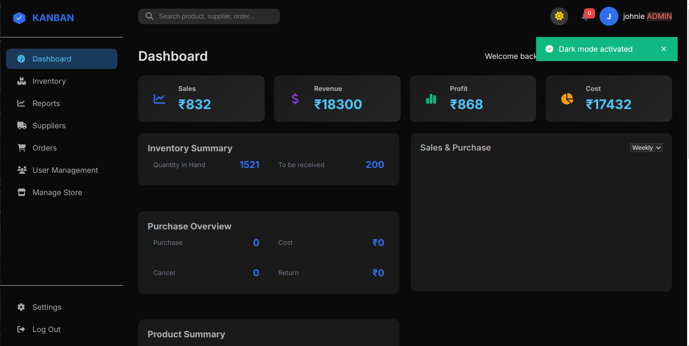

cat > README.md << 'EOF'
# INVENTORY MANAGEMENT SYSTEM - KANBAN

A comprehensive, production-ready inventory management system with Flask REST API backend and modern web frontend. This system provides complete inventory control with user authentication, role-based access control, real-time stock tracking, and detailed analytics.

## Screenshots

| Login Page | Dashboard |
|------------|-----------|
|  |  |

| Inventory | Reports |
|-----------|---------|
|  |  |

| User Management | Dark Mode |
|----------------|-----------|
|  |  |

## Table of Contents

1. [System Overview](#system-overview)
2. [Features](#features)
3. [Technology Stack](#technology-stack)
4. [Prerequisites](#prerequisites)
5. [Installation Guide](#installation-guide)
6. [Configuration](#configuration)
7. [Running the Application](#running-the-application)
8. [API Documentation](#api-documentation)
9. [Database Schema](#database-schema)
10. [Project Structure](#project-structure)
11. [Troubleshooting](#troubleshooting)
12. [Development Guide](#development-guide)
13. [Deployment](#deployment)

## System Overview

This inventory management system helps businesses track products, manage stock levels, process sales, and generate reports. The system features:

- Separate frontend and backend architecture
- RESTful API design following best practices
- JWT-based stateless authentication
- Role-based permissions (Admin, Manager, User)
- Real-time inventory updates
- Complete audit trail of stock movements

## Features

### Core Features
- User authentication with login and registration
- Role-based access control with three user levels
- Complete product management (Create, Read, Update, Delete)
- Category management for product organization
- Supplier management with contact information
- Real-time inventory tracking
- Stock in/out transaction recording
- Dashboard with sales analytics and charts
- Order history tracking
- User management for administrators

### Technical Features
- JWT token authentication with refresh capability
- Password hashing using bcrypt
- Database pagination for large datasets
- Filtering and search functionality
- CORS enabled for cross-origin requests
- SQLite database (configurable for PostgreSQL)
- Session timeout after inactivity
- Dark/light mode toggle
- Responsive design for mobile devices

## Technology Stack

### Backend

| Technology | Version | Purpose |
|------------|---------|---------|
| Python | 3.8+ | Programming language |
| Flask | 2.3.3 | Web framework |
| Flask-SQLAlchemy | 3.1.1 | Database ORM |
| Flask-JWT-Extended | 4.5.2 | JWT authentication |
| Flask-Bcrypt | 1.0.1 | Password hashing |
| Flask-CORS | 4.0.0 | Cross-origin requests |
| SQLite | 3 | Development database |
| Marshmallow | 3.20.1 | Data serialization |

### Frontend

| Technology | Purpose |
|------------|---------|
| HTML5 | Structure |
| CSS3 | Styling and responsive design |
| JavaScript (Vanilla) | Interactivity and API calls |
| Chart.js | Data visualization |
| Font Awesome | Icons |
| Google Fonts (Inter) | Typography |

## Prerequisites

Before you begin, ensure you have the following installed:

```bash
# Check Python version (3.8 or higher required)
python3 --version

# Check pip package manager
pip3 --version

# Check Git installation
git --version

# Check SQLite (for database access)
sqlite3 --version

For Ubuntu/Debian Users
bash
sudo apt update
sudo apt install python3 python3-pip python3-venv git sqlite3 -y
For macOS Users
bash
brew install python3 git sqlite3
Installation Guide
Step 1: Clone the Repository
bash
# Clone the project from GitHub
git clone https://github.com/CaltonMomaya/INVENTORY-MANAGEMENT-SYSTEM.git

# Navigate into the project directory
cd INVENTORY-MANAGEMENT-SYSTEM
Step 2: Create Virtual Environment
bash
# Create virtual environment
python3 -m venv venv

# Activate virtual environment
# On Linux/macOS:
source venv/bin/activate

# On Windows:
venv\Scripts\activate
Step 3: Install Dependencies
bash
# Install all required packages
pip install -r requirements.txt

# Verify installation
pip list
Expected packages:

Flask==2.3.3

Flask-SQLAlchemy==3.1.1

Flask-JWT-Extended==4.5.2

Flask-Bcrypt==1.0.1

Flask-CORS==4.0.0

python-dotenv==1.0.0

marshmallow==3.20.1

flask-marshmallow==1.0.0

Step 4: Configure Environment Variables
Create a .env file in the root directory:

bash
cat > .env << 'EOF'
FLASK_APP=run.py
FLASK_ENV=development
SECRET_KEY=your-secret-key-here-change-in-production
JWT_SECRET_KEY=jwt-secret-key-here-change-in-production
DATABASE_URL=sqlite:///database.db
EOF
For production, generate secure random keys:

bash
python3 -c "import secrets; print(secrets.token_hex(32))"
Step 5: Initialize the Database
bash
# Create database tables and populate with sample data
flask init-db
This command:

Creates all database tables

Adds an admin user (admin@kanban.com / admin123)

Creates sample categories (Electronics, Groceries, Clothing)

Creates sample suppliers

Adds sample products

Step 6: Verify Database Creation
bash
# Check if database file was created
ls -la instance/

# View database tables
sqlite3 instance/database.db ".tables"
Running the Application
The application requires two servers: backend (Flask API) and frontend (static file server).

Terminal 1 - Backend Server
bash
# Navigate to project root
cd ~/INVENTORY-MANAGEMENT-SYSTEM

# Activate virtual environment
source venv/bin/activate

# Start Flask backend
python3 run.py
Expected output:

text
 * Serving Flask app 'run'
 * Debug mode: on
 * Running on http://127.0.0.1:5000
Terminal 2 - Frontend Server
Open a new terminal window:

bash
# Navigate to frontend directory
cd ~/INVENTORY-MANAGEMENT-SYSTEM/frontend

# Start static file server
python3 -m http.server 8000
Expected output:

text
Serving HTTP on 0.0.0.0 port 8000 ...
Access the Application
Open your web browser and navigate to:

text
http://localhost:8000
Default Login Credentials
Role	Email	Password
Admin	admin@kanban.com	admin123
Manager	Create via signup	User defined
User	Create via signup	User defined
API Documentation
Base URL
text
http://localhost:5000/api
Authentication Endpoints
Register New User
http
POST /auth/register
Content-Type: application/json

{
    "name": "John Doe",
    "email": "john@example.com",
    "password": "password123",
    "role": "user"
}
Response (201 Created):

json
{
    "message": "User created successfully",
    "user": {
        "id": 5,
        "name": "John Doe",
        "email": "john@example.com",
        "role": "user"
    },
    "access_token": "eyJhbGciOiJIUzI1NiIs...",
    "refresh_token": "eyJhbGciOiJIUzI1NiIs..."
}
Login
http
POST /auth/login
Content-Type: application/json

{
    "email": "admin@kanban.com",
    "password": "admin123"
}
Response (200 OK):

json
{
    "message": "Login successful",
    "access_token": "eyJhbGciOiJIUzI1NiIs...",
    "refresh_token": "eyJhbGciOiJIUzI1NiIs...",
    "user": {
        "id": 1,
        "name": "Admin User",
        "email": "admin@kanban.com",
        "role": "admin"
    }
}
Product Endpoints
Get All Products (with pagination)
http
GET /products?page=1&per_page=10&search=excel&category_id=1&low_stock=true
Authorization: Bearer <access_token>
Response (200 OK):

json
{
    "products": [
        {
            "id": 1,
            "name": "Surf Excel",
            "sku": "SURF001",
            "quantity": 150,
            "price": 45.00,
            "is_low_stock": false
        }
    ],
    "pagination": {
        "total": 45,
        "page": 1,
        "per_page": 10,
        "pages": 5,
        "has_next": true,
        "has_prev": false
    }
}
Stock Transaction Endpoints
Add Stock (Stock In)
http
POST /transactions/in
Authorization: Bearer <access_token>
Content-Type: application/json

{
    "product_id": 1,
    "quantity": 50,
    "reference": "PO-2024-001",
    "notes": "Purchase from supplier"
}
Response (201 Created):

json
{
    "message": "Stock added successfully",
    "transaction": {
        "id": 15,
        "transaction_type": "in",
        "quantity": 50,
        "product_name": "Surf Excel"
    },
    "product": {
        "id": 1,
        "quantity": 200
    }
}
Remove Stock (Stock Out)
http
POST /transactions/out
Authorization: Bearer <access_token>
Content-Type: application/json

{
    "product_id": 1,
    "quantity": 10,
    "reference": "SALE-2024-001",
    "notes": "Customer purchase"
}
Response (201 Created):

json
{
    "message": "Stock removed successfully",
    "transaction": {
        "id": 16,
        "transaction_type": "out",
        "quantity": 10,
        "product_name": "Surf Excel"
    },
    "product": {
        "id": 1,
        "quantity": 190
    }
}
Dashboard Statistics
http
GET /transactions/dashboard
Authorization: Bearer <access_token>
Response (200 OK):

json
{
    "sales_overview": {
        "sales": 832,
        "revenue": 18300,
        "profit": 868,
        "cost": 17432
    },
    "inventory_summary": {
        "quantity_in_hand": 1250,
        "to_be_received": 200
    },
    "product_summary": {
        "number_of_suppliers": 5,
        "number_of_categories": 3
    },
    "total_products": 45,
    "low_stock_products": 3
}
HTTP Status Codes
Code	Meaning	Description
200	OK	Request successful
201	Created	Resource created successfully
400	Bad Request	Missing or invalid parameters
401	Unauthorized	Missing or invalid token
403	Forbidden	Insufficient permissions
404	Not Found	Resource does not exist
409	Conflict	Duplicate entry
500	Internal Error	Server error
Database Schema
Tables Structure
sql
-- Users table
CREATE TABLE users (
    id INTEGER PRIMARY KEY,
    name VARCHAR(100) NOT NULL,
    email VARCHAR(120) UNIQUE NOT NULL,
    password_hash VARCHAR(200) NOT NULL,
    role VARCHAR(20) DEFAULT 'user',
    is_active BOOLEAN DEFAULT 1,
    created_at DATETIME,
    updated_at DATETIME
);

-- Products table
CREATE TABLE products (
    id INTEGER PRIMARY KEY,
    name VARCHAR(100) NOT NULL,
    sku VARCHAR(50) UNIQUE NOT NULL,
    description VARCHAR(500),
    quantity INTEGER DEFAULT 0,
    price FLOAT NOT NULL,
    cost FLOAT NOT NULL,
    reorder_level INTEGER DEFAULT 10,
    category_id INTEGER REFERENCES categories(id),
    supplier_id INTEGER REFERENCES suppliers(id),
    created_at DATETIME,
    updated_at DATETIME
);

-- Transactions table
CREATE TABLE transactions (
    id INTEGER PRIMARY KEY,
    transaction_type VARCHAR(20) NOT NULL,
    quantity INTEGER NOT NULL,
    reference VARCHAR(100),
    notes VARCHAR(500),
    product_id INTEGER REFERENCES products(id),
    user_id INTEGER REFERENCES users(id),
    created_at DATETIME
);
Project Structure
text
INVENTORY-MANAGEMENT-SYSTEM/
│
├── app/                           # Backend application
│   ├── __init__.py               # App factory
│   ├── config.py                 # Configuration
│   ├── models/                   # Database models
│   ├── controllers/              # Business logic
│   ├── routes/                   # API endpoints
│   └── utils/                    # Helper functions
│
├── frontend/                     # Frontend application
│   ├── index.html               # Main HTML
│   ├── css/                     # Stylesheets
│   └── js/                      # JavaScript files
│
├── instance/                     # Database folder
│   └── database.db              # SQLite database
│
├── screenshots/                  # Documentation images
│   ├── login.png
│   ├── dashboard.png
│   ├── inventory.png
│   ├── reports.png
│   ├── users.png
│   └── darkmode.png
│
├── requirements.txt              # Python dependencies
├── run.py                       # Entry point
├── .env                         # Environment variables
└── README.md                    # Documentation
Troubleshooting
Common Issues and Solutions
Issue: ModuleNotFoundError
text
ModuleNotFoundError: No module named 'flask'
Solution:

bash
source venv/bin/activate
pip install -r requirements.txt
Issue: Database not found
text
sqlalchemy.exc.OperationalError: no such table
Solution:

bash
flask init-db
Issue: Port already in use
text
OSError: [Errno 98] Address already in use
Solution:

bash
lsof -i :5000
kill -9 <PID>
Deployment
Using Gunicorn (Linux/macOS)
bash
pip install gunicorn
gunicorn -w 4 -b 0.0.0.0:5000 run:app
Using Docker
dockerfile
FROM python:3.9-slim
WORKDIR /app
COPY requirements.txt .
RUN pip install -r requirements.txt
COPY . .
EXPOSE 5000
CMD ["gunicorn", "-w", "4", "-b", "0.0.0.0:5000", "run:app"]
bash
docker build -t inventory-system .
docker run -p 5000:5000 inventory-system
License
MIT License

Author
Calton Momaya

GitHub: @CaltonMomaya

Moringa School Student

Acknowledgments
Flask documentation and community

SQLAlchemy ORM team

Chart.js for visualizations

Font Awesome for icons

Moringa School for guidance

Built with passion for inventory management
EOF

echo "README.md has been completely rewritten with proper formatting!"

text

Now push the updated README to GitHub:

```bash
cd ~/INVENTORY-MANAGEMENT-SYSTEM
git add README.md
git commit -m "Fix README formatting with proper code blocks"
git push origin main